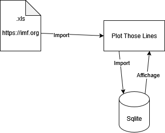
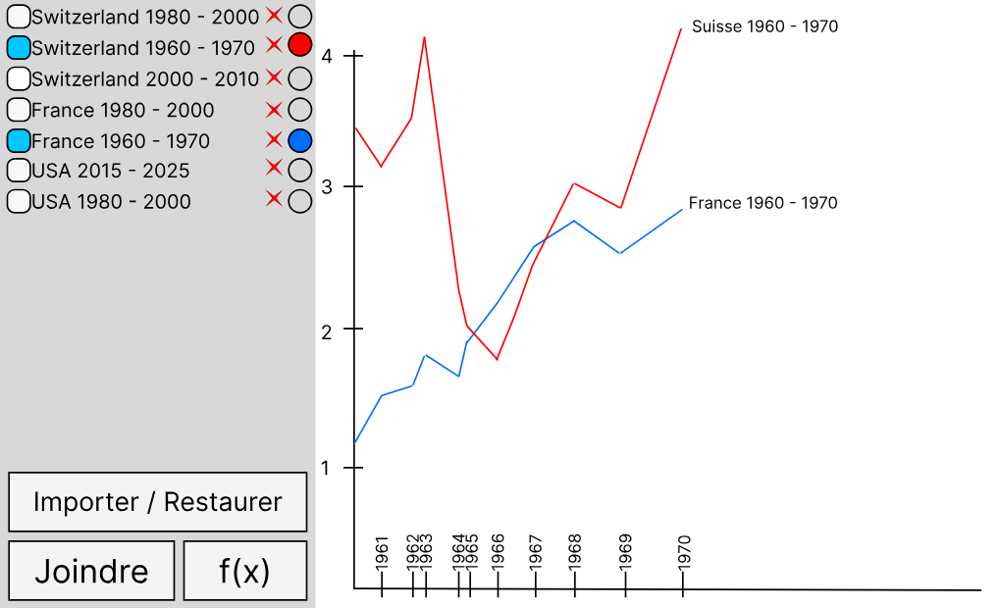
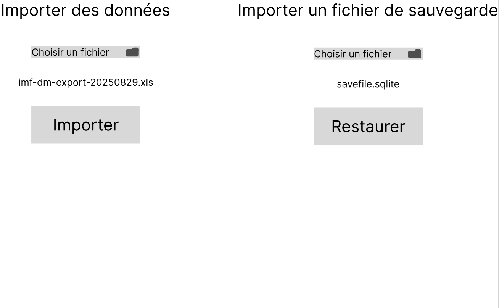
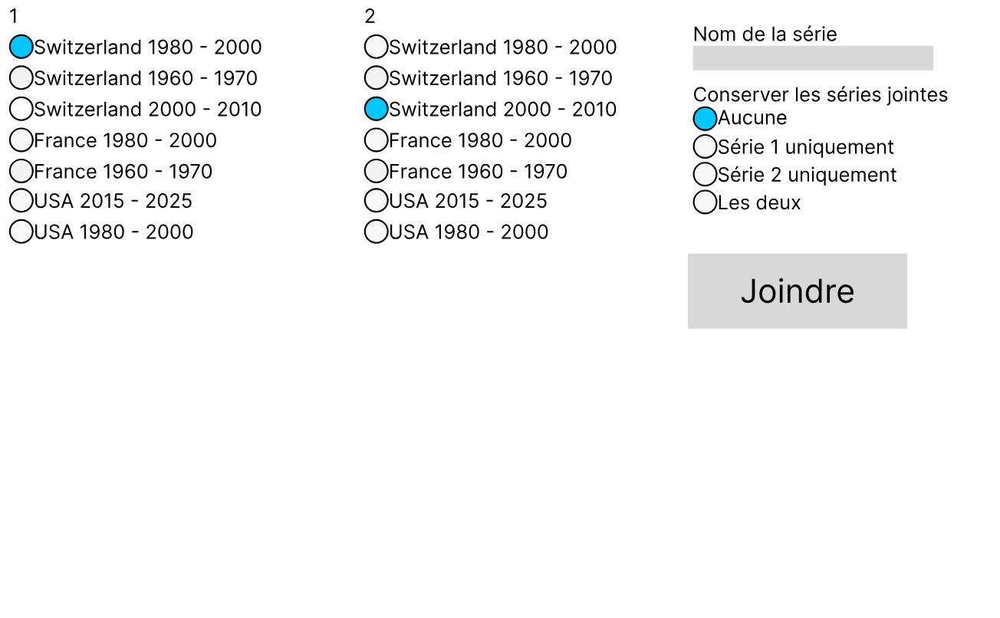
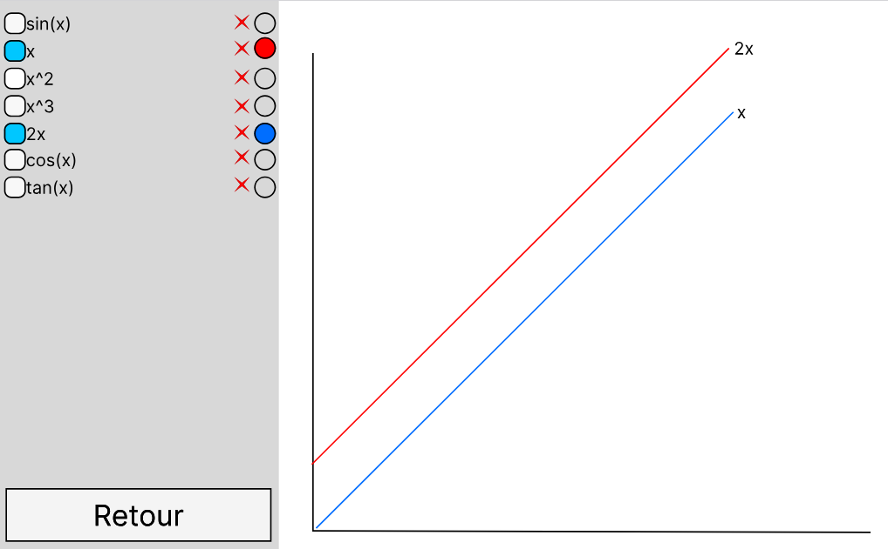

# Plot Those Lines
## Introduction
### Objectif pédagogique
Le but de ce projet est d'appliquer nos connaissances en programmation fonctionnelle avec linQ, ainsi que de remettre en pratique les connaissances de Programmation Orientée Objet vue en deuxième année. De plus il s'agit d'une occasion d'appliquer les conventions de codage et de renforcer nos capacités à produire un code propre, commenté, testé et dépourvu de bugs. La phase de planification permettra également d'ameliorer nos compétences en rédaction d'User Story et tests d'acceptances. 

### Objectif produit
L'objectif de ce projet est de réaliser une application pour afficher des données sous forme de séries temporelles. L'application permettra d'importer des fichiers de données. Ces fichiers seront stockés de manière permanente et seront affichée dans un graphique, avec le temps en abscisse et les valeurs en ordonnée. L'application permettra de seléctionner quelles séries sont affichées ainsi que leur couleur. Il sera également possible de joindre des séries, par exemple: si j'ai un fichier qui contient les données des années 2021 à 2023 et un autre fichier qui contient les données de 2024 et 2025, il est possible de combiner ces séries pour en faire une série de 2020 à 2025. De plus, un mode fonction permetant d'afficher des fonctions mathématique pourra être implementé.

#### Schéma de l'environement

#### Maquettes
- La page d'accueil:

- La page d'importation des données:

- La page de jonction des séries:

- La page des fonctions:

### Description du domaine
L'application `Plot Those Lines` sera utilisé pour observer l'évolution d'un facteur économique clé: le PIB. Le Produit Intérieur Brut mesure la quantité de richesse produite par un pays en une année. Cet indicateur, bien qu'imparfait car ne prenant pas en compte le niveau de vie des habitants et les ressources naturelles, est utilisé pour mesurer la santé économique d'un pays. Dans l'application Plot Those Lines, chaque série sera l'évolution du PIB par pays au fil des ans. Cette application permettra aux économistes de comparer l'évolution du PIB entre plusieurs pays, et on pourrais même imaginer qu'un jour, un enseignant d'économie utilise cette application pour expliquer le PIB à ses élèves. Les données seront téléchargées depuis le site de l'[International Monetary Fund](https://imf.org).
Par exemple : 
- [Le PIB mondial par pays, en milliard de dollars](https://www.imf.org/external/datamapper/NGDPD@WEO/OEMDC/ADVEC/WEOWORLD)
- [Le PIB mondial par pays, par personne](https://www.imf.org/external/datamapper/NGDPDPC@WEO/OEMDC/ADVEC/WEOWORLD)

Les données de tests sont disponibles dans le répertoire [données](./donnees/);

## Planification
L'idée est de commencer par importer des fichiers de données, puis de s'occuper de l'affichage, et ensuite de stocker tous cela dans une base de données.
Les tâches seront réalisée dans cet ordre:

- Semaine 3: [Afficher des séries temporelles](https://github.com/ASETML/PlotThoseLines/issues/1)
- Semaine 4: [Flexibilité de l'affichage](https://github.com/ASETML/PlotThoseLines/issues/2)
- Semaine 5: [Importer des séries de manières permanentes](https://github.com/ASETML/PlotThoseLines/issues/3)
- Semaine 6: [Joindre des séries](https://github.com/ASETML/PlotThoseLines/issues/4)
- Semaine 7: Retouches, améliorations

La storie [Afficher des fonctions](https://github.com/ASETML/PlotThoseLines/issues/5) ne sera pas réalisée par manque de temps.

### Modification semaine 7
- Les storie d'affichage prennent plus de temps que prévu.
- La première tâche qui sera effectuée lors de ces deux semaines de vacances sera d'[importer des séries de manières permanentes](https://github.com/ASETML/PlotThoseLines/issues/3)

## Rapport de tests
### Afficher des séries temporelles
En tant qu’utilisateur, je veux afficher une représentation graphique de plusieurs
séries temporelles (time serie) simultanément.

TA:
- [x] Quand je démarre l'application, j'arrive sur la page d'accueil
- [x] Sur la page d'accueil, quand je clique sur le bouton `Importer / Restaurer`, alors j'arrive sur la page d'import et de restauration (Maquette import)
- [x] Sur la page d'import et de restauration, quand je clique sur `Retour`, alors je revient à l'accueil et aucune nouvelle données n'est présente
- [x] Sur la page d'import et de restauration, dans la section `Importer des données`, après avoir choisi mon fichier, quand je clique sur `Importer`, alors j'arrive sur la page d'accueil et les séries importées y sont présentes.
- [x] Si le fichier n'a pas pu être importé, alors un message d'erreur s'affiche et je reste sur la même page

Maquettes:
- Accueil
- Import / Restauration

Cette story fonctionne entièrement.

### Importer des séries de manière permanente
En tant qu’utilisateur, je veux importer des séries de données de façon
permanente. PTL me permet d’importer des fichiers excel (.xls)

TA:
- [x] Quand j'ai importé des données et que je ferme l'application, alors les données sont présente au prochain lancement de l'application
- [x] Sur la page d'accueil, quand je clique sur la croix à droite du nom de la série, alors un message de confirmation s'affiche: si je clique sur `OK`, la série est supprimée, sinon la série n'est pas supprimée
- [x] Quand j'importe des données, alors une snapshot du fichier de sauvegarde est créée
- [x] Sur la page d'import / restauration, dans la section `Importer un fichier de sauvegarde`, après avoir selectionné une snapshot, quand je clique sur `Restaurer`, alors je revient à l'état de la snapshot importées
- [x] Quand j'importe un fichier qui contient des données déjà présente, alors les séries "en double" sont remplacées par celles que je vient d'importer

Maquettes:
- Accueil
- Import / Restauration

Cette story fonctionne entièrement.

### Flexibilité de l'affichage
En tant qu’utilisateur, je veux pouvoir bénéficier d’une grande flexibilité d’affichage afin de pouvoir
analyser mes données en détail.

TA:
- [x] Je zoome sur le graphique avec la molette
- [x] Je me déplace sur le graphique en déplaçant la souris avec clic gauche maintenu
- [x] Je change l'échelle des axes  en déplaçant la souris avec clic droit maintenu
- [x] Je zoome sur une zone du graphique en déplaçant la souris avec clic molette maintenu
- [x] Dans l'interface, il y a une liste à cocher qui contrôle les séries affichée
- [x] Quand je clique sur le sélecteur de couleur d'une série, alors un colorpicker s'ouvre et je peux choisir la couleur de la série
- [ ] Quand je survol une série, je vois la valeur du point le plus proche
- [ ] Lorsqu'on survol une série, son nom s'affiche sur le graphique

Maquettes:
- Accueil

Cette story ne fonctionne pas totalement. Le survol de la série n'a pas été implementé par manque de temps.

## Journal de travail
L'outil utilisé pour le journal de travail est [gitjournal](https://github.com/ETML-INF/gitjournal). L'export pdf est disponible [ici](./jdt.pdf).

## Utilisation de l'IA
Je n'ai pas utilisé d'outil d'intelligence artificielle lors de ce projet, car je n'ai pas recontré de problèmes ne pouvant être résolu par des moyens traditionnels, comme une recherche google.

## Conclusion
### Bilan technique
Les deux stories les plus importantes du projet ont été réalisé: l'import des données et le stockage dans une base de données. La story pour joindre les données n'a pas été réalisé par manque de temps et la story d'affichage n'a pas été complètement finie: il manque le survol des points. La jonction des séries n'a pas pu être implementée par manque de temps. Comme prévu, le mode fonction n'a pas été réalisé. Le spinner de chargement ne fonctionne pas, car le GIF de chargement n'apparait pas.

### Bilan personnel
Bien que la planification initiale était cohérente, la mauvaise estimation du temps nécessaires aux à la réalisation des storie à mis le projet en retard. De plus, je me suis parfois éparpillé sur des tâches peu importantes avec des résultats peu probants ont également ralenti le projet. Par exemple: [spinner de chargement](https://github.com/ASETML/PlotThoseLines/commit/8ed0878cd8c2cdab19008a89e8694c0d5cd9c9f7), [afficher la valeur du point le plus proche du curseur](https://github.com/ASETML/PlotThoseLines/commit/d87814e9a825300703d0768004fa4048fe17fa69), [checkbox pour l'affichage des points](https://github.com/ASETML/PlotThoseLines/commit/d4e4ba550dd38fc57d4c01d559c685ea622af0b3)  

Cependant, le projet était très intéressant et m'a permis d'appliquer mes connaissances en linQ et plus de réexercer mes connaissances en Windows Forms et POO. De plus, j'ai appris à intégrer une base de données SQlite à mon application. Les trois semaine de User Story au début du projet n'ont pas été très agréable - j'aurais préféré coder - mes elles étaient nécessaires pour réaliser une application de qualité et ne pas se perdre en route. J'espère que lors du prochain projet, elles prendront moins de temps à réaliser, ce qui sera sans doute le cas grâce à l'expérience gagnée sur ce projet.
