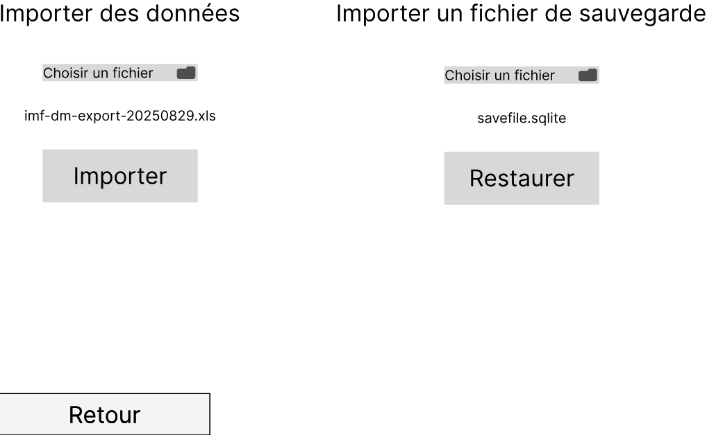
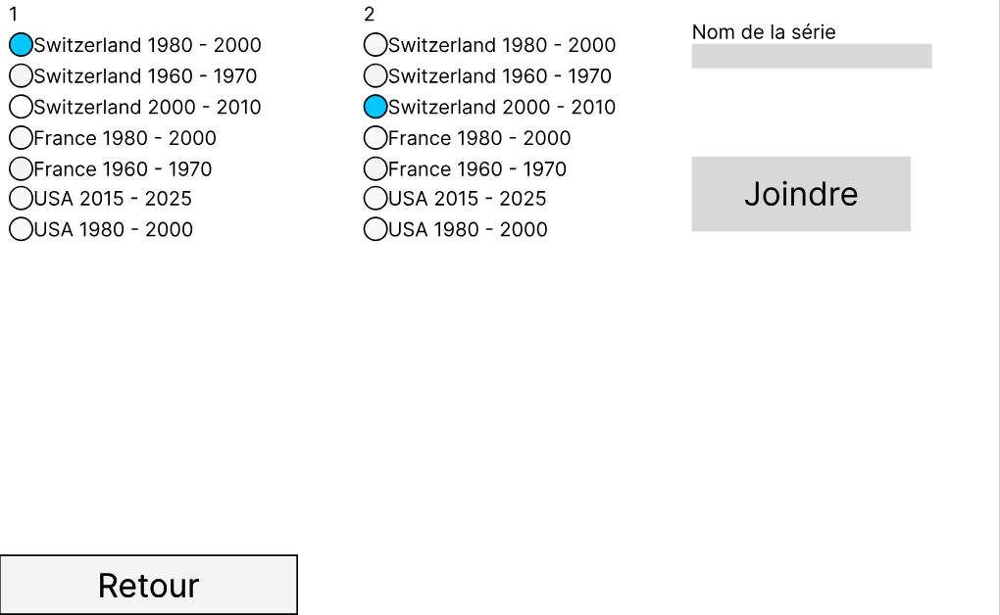

# Plot Those Lines
## Introduction
### Objectif pédagogique
- Appliquer la programmation fonctionelle en c# avec linQ

### Objectif produit
Réaliser une application pour afficher des données sous forme de serie temporelle. L'application permettra d'importer des fichiers de données. Ces fichiers seront stockés de manière permanente et seront affichée dans un graphique, avec le temps en abscisse et les valeurs en ordonnée.

#### Schéma de l'environement

#### Maquettes
- La page d'accueil: 

- La page d'importation des données:

- La page de jonction des séries:

- La page des fonctions:

### Description du domaine
L'application `Plot Those Lines` sera utilisé pour observer l'évolution du PIB. Chaque série sera l'évolution du PIB par pays au fil des ans. Cette application sera utiles aux économistes. Les données seront téléchargées depuis le site de l'[International Monetary Fund](https://imf.org).
Par exemple : 
- [Le PIB mondial par pays, en milliard de dollars](https://www.imf.org/external/datamapper/NGDPD@WEO/OEMDC/ADVEC/WEOWORLD)
- [Le PIB mondial par pays, par personne](https://www.imf.org/external/datamapper/NGDPDPC@WEO/OEMDC/ADVEC/WEOWORLD)

## Planification
L'idée est de commencé par importer des fichiers de données, puis de s'occuper de l'affichage, et ensuite de stocker tous cela dans une base de données.
Les tâches seront réalisée dans cet ordre:

### Semaine 3
- [Afficher des séries temporelles](https://github.com/ASETML/PlotThoseLines/issues/1)

### Semaine 4
- [Flexibilité de l'affichage](https://github.com/ASETML/PlotThoseLines/issues/2)

### Semaine 5
- [Importer des séries de manières permanentes](https://github.com/ASETML/PlotThoseLines/issues/3)

### Semaine 6
- [Joindre des séries](https://github.com/ASETML/PlotThoseLines/issues/4)

### Semaine 7
- Retouches, améliorations

La storie [Afficher des fonctions](https://github.com/ASETML/PlotThoseLines/issues/5) ne sera pas réalisée par manque de temps.

### Modification semaine 7
- Les storie d'affichage prennent plus de temps que prévu.
- La première tâche qui sera effectuée lors de ces deux semaines de vacances sera d'[importer des séries de manières permanentes](https://github.com/ASETML/PlotThoseLines/issues/3)

## Rapport de tests
### Afficher des séries temporelles
En tant qu’utilisateur, je veux afficher une représentation graphique de plusieurs
séries temporelles (time serie) simultanément.

TA:
- [x] Quand je démarre l'application, j'arrive sur la page d'accueil
- [x] Sur la page d'accueil, quand je clique sur le bouton `Importer / Restaurer`, alors j'arrive sur la page d'import et de restauration (Maquette import)
- [x] Sur la page d'import et de restauration, quand je clique sur `Retour`, alors je revient à l'accueil et aucune nouvelle données n'est présente
- [x] Sur la page d'import et de restauration, dans la section `Importer des données`, après avoir choisi mon fichier, quand je clique sur `Importer`, alors j'arrive sur la page d'accueil et les séries importées y sont présentes.
- [x] Si le fichier n'a pas pu être importé, alors un message d'erreur s'affiche et je reste sur la même page

Maquettes:
- Accueil
- Import / Restauration

## Journal de travail
Gitjournal
## Utilisation de l'IA
## Conclusion
### Bilan technique
### Bilan personnel
Bien que la planification initiale était cohérente, la mauvaise estimation du temps nécessaires aux à la réalisation des storie à mis le projet en retard. De plus, je me suis parfois éparpillé sur des tâches peu importantes avec des résultats peu probants ont également ralenti le projet. Par exemple: [spinner de chargement](https://github.com/ASETML/PlotThoseLines/commit/8ed0878cd8c2cdab19008a89e8694c0d5cd9c9f7), [afficher la valeur du point le plus proche du curseur](https://github.com/ASETML/PlotThoseLines/commit/d87814e9a825300703d0768004fa4048fe17fa69), [checkbox pour l'affichage des points](https://github.com/ASETML/PlotThoseLines/commit/d4e4ba550dd38fc57d4c01d559c685ea622af0b3)